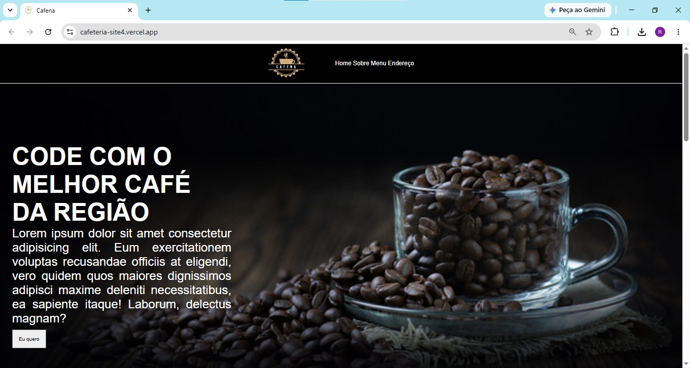
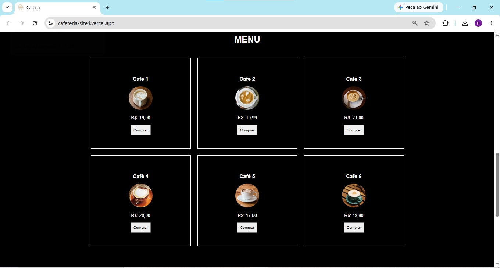
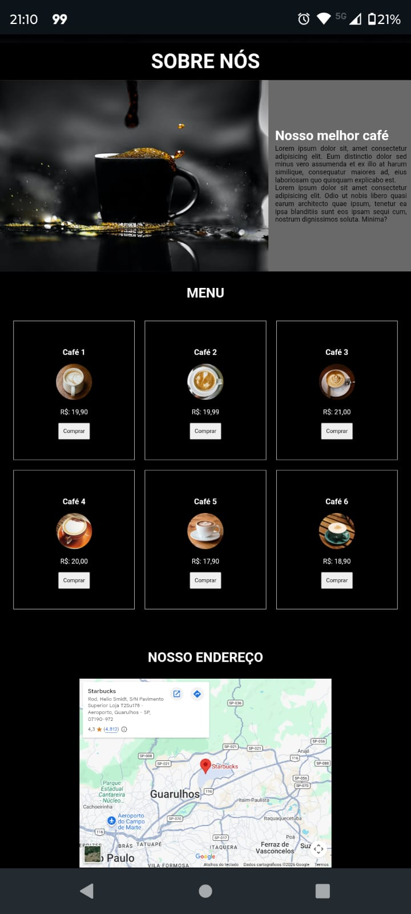

# ☕ Cafeteria Gourmet

Projeto desenvolvido com HTML, CSS e JavaScript para simular o site de uma cafeteria moderna, com apresentação de produtos, ambiente aconchegante e design responsivo.

## 🚀 Funcionalidades

- Página inicial moderna
- Catálogo de cafés e produtos
- Layout responsivo para celular e desktop
- Navegação intuitiva
- Interface desenvolvida com HTML, CSS e JavaScript

## 🛠️ Tecnologias Utilizadas

- HTML5
- CSS3
- JavaScript

## 📸 Pré-visualização

### Página Inicial

### Cardápio

### Versão Mobile

## 🌐 Demonstração

https://cafeteria-site4.vercel.app/

## 📚 Aprendizados

Durante o desenvolvimento deste projeto foram praticados conceitos de:

- Estruturação semântica com HTML
- Estilização avançada com CSS
- Responsividade com Media Queries
- Manipulação de elementos com JavaScript
- Organização de arquivos para projetos Front-End

## 👨‍💻 Autor

Ricardo Carvalho

GitHub: https://github.com/RicardopcJunior
